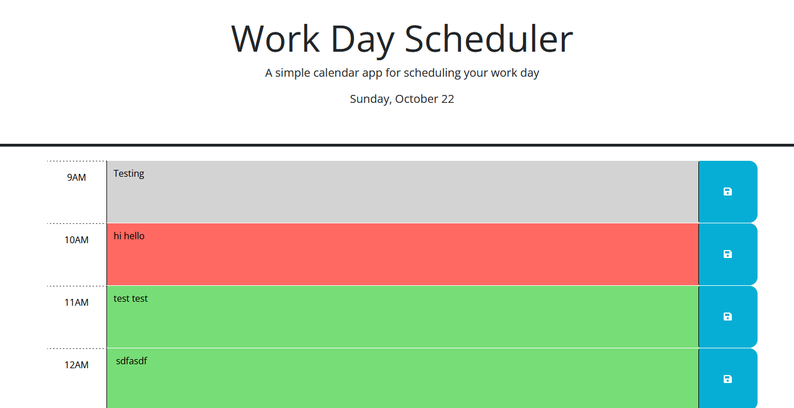

# Work Day Planner

## Description

The goal of this project was to create a simple workday planner in the browser. The user may input and save their to do list, which saves in localstorage, and is color coded depending on what time it is. (Green for future, red for current hour, gray for past).  

## Installation

N/A

## Usage

Open the deployed project via GitHub pages [here](https://whimsically.github.io/workdayplanner/). Then, type your to do list in the text areas and press the corresponding save buttons.

## Credits

This project is part of my studies in the KU Full Stack Bootcamp. The HTML and CSS were provided as starter code.

## License

Please see license in github repo